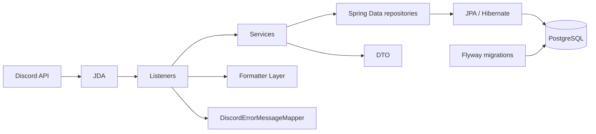
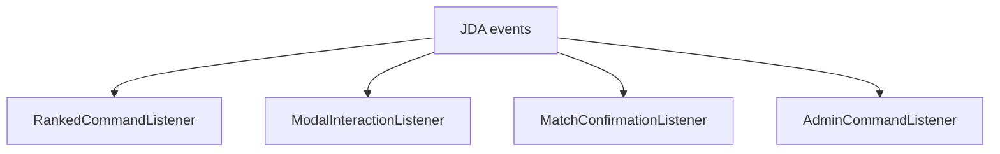

# Архитектура

## Общая схема

Приложение представляет собой один Spring Boot-процесс. HTTP API отсутствует: внешней точкой входа служат Discord interactions, получаемые через JDA.



Основное направление зависимостей:

```text
Discord / JDA
    ↓
Listeners
    ↓
Services
    ↓
Spring Data repositories
    ↓
JPA / Hibernate
    ↓
PostgreSQL
```

## Discord-слой

JDA направляет события четырём специализированным listener’ам:



### `DiscordConfig`

Это Spring configuration/bootstrap component, а не звено runtime request flow. Он создаёт singleton `JDA`, включает intents `GUILD_MESSAGES` и `DIRECT_MESSAGES`, регистрирует четыре listener’а и ожидает готовности подключения. После подключения глобально обновляет две slash-команды:

- `/ranked` без специальных default permissions;
- `/admin` с default permission `ADMINISTRATOR`.

При завершении Spring context вызывается `JDA.shutdown()`.

### `RankedCommandListener`

Обрабатывает `/ranked`, регистрацию и изменение профиля, кнопки пользовательского меню, выбор соперника, выбор игрока для истории, leaderboard и историю матчей. Пользовательские меню и списки отправляются ephemeral. Listener преобразует Discord User в Discord ID и username, после чего вызывает сервисы.

### `ModalInteractionListener`

Обрабатывает только динамические формы `modal:report_match:{opponentDiscordId}`. Он парсит счёт, вызывает предварительную бизнес-валидацию и публикует сообщение с кнопками подтверждения и отклонения.

### `MatchConfirmationListener`

Обрабатывает публичные кнопки результата. Подтверждение разрешено только заявленному сопернику; отклонение — репортеру или сопернику. После успешного действия исходное сообщение редактируется, а компоненты удаляются.

### `AdminCommandListener`

Обрабатывает `/admin` и все `admin:*` interactions. Для slash-команды, каждой кнопки, modal и user-select повторно проверяются наличие guild/member и permission `ADMINISTRATOR`. Listener зависит от фасада `AdminService`, а не от репозиториев.

### Formatter layer

`RankedMessageFormatter` и `AdminMessageFormatter` строят embeds и текстовые представления. `DiscordTableFormatter` выравнивает таблицы, очищает ячейки и разбивает длинный вывод по безопасному лимиту сообщения. В этом слое находятся JDA-типы `MessageEmbed`; сервисный слой их не использует.

### `DiscordErrorMessageMapper`

Преобразует ожидаемые `BusinessException` в сообщения для пользователя и отделяет их от внутренних ошибок. Неожиданные исключения логируются listener’ом, а пользователю возвращается общее сообщение без технических деталей.

## Сервисный слой

- `RegistrationService` создаёт или повторно использует постоянного игрока и регистрирует его в активном сезоне; также меняет сезонный display name.
- `PlayerService` формирует пользовательский и административный профиль, вычисляет текущее место и перечисляет всех участников активного сезона.
- `MatchService` валидирует FT5, формирует preview, записывает подтверждённый матч, выдаёт историю и выполняет арифметический rollback.
- `EloCalculator` — чистая статическая Java-функция без Spring-зависимостей.
- `LeaderboardService` строит текущую или финальную таблицу и присваивает tier по месту.
- `SeasonService` управляет lifecycle и сохраняет `finalRank` при завершении.
- `SeasonHistoryService` читает только завершённые сезоны и их снимки.
- `AdminService` — тонкий фасад над сервисами для административного Discord-слоя.

Публичные методы сервисов принимают Discord ID, числа, строки и даты и возвращают immutable record DTO. JDA events, callbacks, embeds и компоненты в business/service layer отсутствуют.

## Репозитории, DTO и сущности

Spring Data repositories инкапсулируют запросы, сортировку и JPA lock modes. Сущности `PlayerEntity`, `SeasonEntity`, `SeasonPlayerEntity` и `MatchEntity` отображают четыре таблицы. DTO фиксируют данные, которые разрешено передавать за границу транзакции; это особенно важно при `spring.jpa.open-in-view=false`.

## Транзакции и конкурентный доступ

Транзакционные границы расположены на сервисных операциях:

- запросы профиля, leaderboard, истории и preview помечены `@Transactional(readOnly = true)`;
- регистрация, изменение имени, запись/rollback матча и lifecycle сезона выполняются в обычных `@Transactional`;
- mapping lazy-связей в DTO выполняется внутри сервисной транзакции.

Для согласования операций используются database locks:

1. Запись матча получает `PESSIMISTIC_READ` на строку активного сезона. Завершение или изменение сезона требует `PESSIMISTIC_WRITE`, поэтому не может пройти посередине записи матча.
2. Обе записи `season_players` блокируются `PESSIMISTIC_WRITE` одним запросом с `ORDER BY sp.id`. Стабильный порядок предотвращает lost update и снижает риск deadlock для матчей с общим участником.
3. Регистрация также держит read-lock активного сезона до создания участия, поэтому завершение сезона не может зафиксировать снимок и одновременно пропустить позднего участника.
4. Завершение сезона берёт write-lock сезона, вычисляет standings, записывает `finalRank` и переводит сезон в `FINISHED` в одной транзакции.
5. Rollback сначала блокирует матч на запись, затем активный сезон на чтение и обе записи участников на запись. Повторный rollback уже удалённого матча завершается `MatchNotFoundException`.
6. Создание уникального ника и активация сезона дополнительно защищены ограничениями PostgreSQL; `DataIntegrityViolationException` для ожидаемых конфликтов преобразуется в business error.
7. Исключение игрока и изменение его имени берут read-lock сезона и write-lock участия. Запись матча проверяет исключение после блокировки обоих участников. Поэтому параллельный матч либо завершается до исключения и сохраняется, либо отклоняется без изменения рейтинга. Завершение сезона не может пройти посередине исключения.

Интеграционные тесты проверяют гонки общих rating updates, match/finish, registration/finish, rollback/finish, повторную Discord identity и регистронезависимый display name.

## Elo

Начальный рейтинг — 1000. Expected score рассчитывается по стандартной шкале 400, а фактический результат учитывает разницу счёта FT5 как `0.5 + sqrt(diff) * 0.2`. K-factor зависит от числа уже сыгранных матчей: 16 до пятой игры, 24 для 5–9 игр и 32 начиная с десятой. Победитель всегда получает минимум `+1`, проигравший теряет минимум `-1`, но итоговый рейтинг ограничен снизу нулём. В `matches` сохраняется именно фактически применённая delta после этого ограничения.

## Ограничения interaction-flow

Подтверждающее сообщение не является отдельной сущностью БД: Discord IDs и счёт кодируются в component ID. `MatchConfirmationListener` хранит обработанные Discord message ID в локальном `ConcurrentHashMap` в течение часа.

Это даёт защиту от параллельных повторных нажатий в одном процессе. После успеха кнопки удаляются из сообщения; после business/internal error guard снимается и операцию можно повторить. Ограничение не является долговечной идемпотентностью: guard теряется при рестарте, не разделяется между несколькими экземплярами приложения и не запрещает создать несколько разных confirmation messages для одного результата. В схеме БД нет уникального ключа Discord interaction или challenge.

Административный rollback восстанавливает сохранённые delta и `gamesPlayed`, но не пересчитывает Elo более поздних матчей. Код разрешает удалить любой матч активного сезона, если обратное применение не делает рейтинг или число игр отрицательными.
