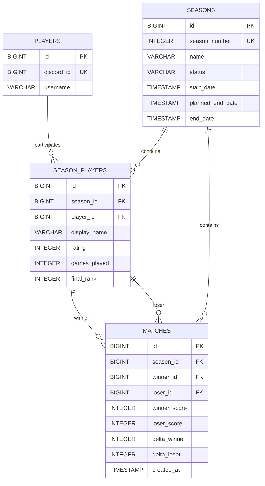

# База данных

## Управление схемой

Приложение использует PostgreSQL и Flyway. Hibernate настроен с `ddl-auto=validate`: он проверяет соответствие JPA mapping уже мигрированной схеме, но не создаёт и не изменяет таблицы.

## `players`

`PlayerEntity` представляет постоянную Discord identity. `discord_id` — стабильный внешний ключ, а `username` — актуальный снимок Discord username, который обновляется при регистрации в новом сезоне. Игровой ник в этой таблице не хранится.

| Поле | Свойства |
| --- | --- |
| `id` | `BIGSERIAL`, primary key |
| `discord_id` | `BIGINT`, unique; SQL V1 не задаёт `NOT NULL` |
| `username` | `VARCHAR(100) NOT NULL` |

## `seasons`

`SeasonEntity` описывает lifecycle рейтингового сезона.

| Поле | Назначение |
| --- | --- |
| `id` | внутренний primary key |
| `season_number` | уникальный положительный номер по правилам сервиса |
| `name` | название до 100 символов |
| `status` | `CREATED`, `ACTIVE` или `FINISHED` |
| `start_date` | фактическое время активации |
| `planned_end_date` | необязательная плановая дата |
| `end_date` | фактическое время завершения |

Допустимые переходы в сервисе: `CREATED → ACTIVE → FINISHED`. Повторная активация/завершение и прямое завершение `CREATED` запрещены. Частичный уникальный индекс гарантирует не более одного `ACTIVE` сезона. Номер может быть введён администратором; sequence `season_number_seq` используется сервисным overload, который автоматически выдаёт следующий номер.

## `season_players`

`SeasonPlayerEntity` — участие постоянного игрока в конкретном сезоне. Поэтому здесь находятся все изменяемые сезонные данные:

- `display_name` — игровой ник-снимок этого сезона;
- `rating` — MMR, стартовое значение 1000 задаёт Java-конструктор;
- `games_played` — число учтённых матчей;
- `final_rank` — место, зафиксированное при завершении.

Одна Discord identity может участвовать во многих сезонах под разными именами и с независимым рейтингом. Пара `(season_id, player_id)` уникальна. Индекс `(season_id, lower(display_name))` запрещает одинаковые сезонные ники без учёта регистра, но разрешает такой же ник в другом сезоне.

`final_rank` заполняется только для участников с `games_played > 0`, в порядке leaderboard на момент завершения. Участник без матчей остаётся зарегистрированным с `final_rank = NULL` и отображается как «Без ранга».

## `matches`

`MatchEntity` хранит подтверждённый матч одного сезона. `winner_id` и `loser_id` ссылаются не на `players`, а на `season_players`, поскольку результат и delta относятся к сезонному рейтингу. `season_id` отдельно связывает матч с сезоном.

Сохраняются счёт победителя и проигравшего, фактически применённые `delta_winner`/`delta_loser` и `created_at`. При достижении нижней границы MMR в delta записывается ограниченная потеря, поэтому арифметический rollback может точно восстановить прежний рейтинг.

База проверяет, что участники различаются и что `winner_score > loser_score` при неотрицательных значениях. Правило FT5 — ровно 5 у победителя и 0–4 у проигравшего — проверяет сервис, а не SQL. SQL также не содержит constraint, который доказывает принадлежность `winner_id` и `loser_id` тому же `season_id`; это проверяется бизнес-логикой.

## Ограничения и индексы

Фактически миграциями созданы:

- unique constraint `players_discord_id_key` на `players.discord_id`;
- unique constraint на `seasons.season_number`;
- check constraint `chk_season_status` для трёх статусов;
- partial unique index `uq_seasons_single_active` на `seasons(status) WHERE status = 'ACTIVE'`;
- unique constraint `uq_season_player` на `(season_id, player_id)`;
- unique index `uq_season_player_display_name_ci` на `(season_id, lower(display_name))`;
- checks `rating >= 0`, `games_played >= 0`, `final_rank IS NULL OR final_rank > 0`;
- check `winner_id <> loser_id`;
- check неотрицательного счёта и `winner_score > loser_score`;
- индексы по `season_players.season_id`, `season_players.player_id`, `matches.season_id`, `matches.winner_id`, `matches.loser_id`;
- foreign keys из `season_players` в `players`/`seasons` и из `matches` в `seasons`/`season_players`.

Каскадное удаление в foreign keys не настроено.

## Flyway migrations

### `V1__initial_schema.sql`

Создаёт `players`, `seasons`, `season_players`, `matches`, основные primary/foreign/unique/check constraints и lookup-индексы. В первой версии `display_name` находился в `players`.

### `V2__season_player_display_name.sql`

Добавляет `season_players.display_name`, копирует в него существующее значение из `players`, делает поле обязательным, создаёт регистронезависимую уникальность внутри сезона и удаляет `players.display_name`.

### `V3__season_lifecycle_invariants.sql`

Создаёт `season_number_seq`, инициализирует его значением после максимального существующего номера и добавляет `uq_seasons_single_active`.

Миграции отражают порядок эволюции схемы, но прикладная модель должна читаться по итоговому состоянию после V3.
